# PCB Project 1 - Getting to Blinky

**Tutorial Series:**

[YouTube KiCad Tutorial - Shawn Hymel - PCB Design](https://www.youtube.com/playlist?list=PL3bNyZYHcRSUhUXUt51W6nKvxx2ORvUQB)

## Outcome

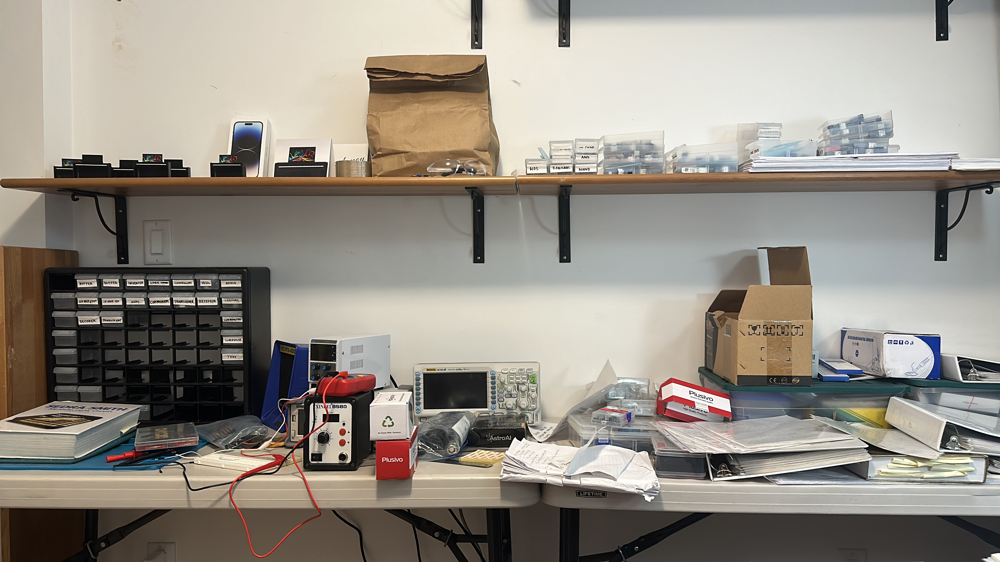
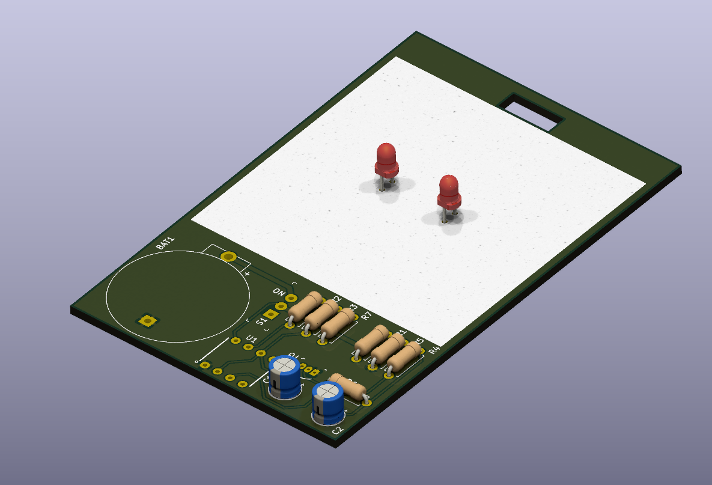
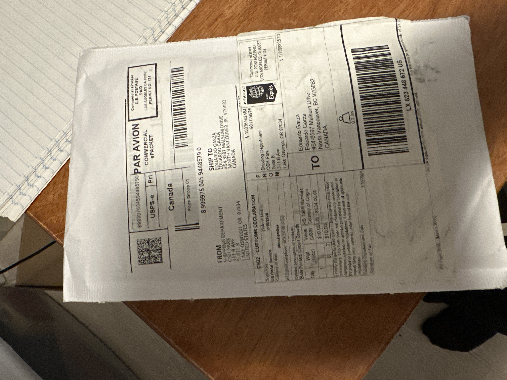
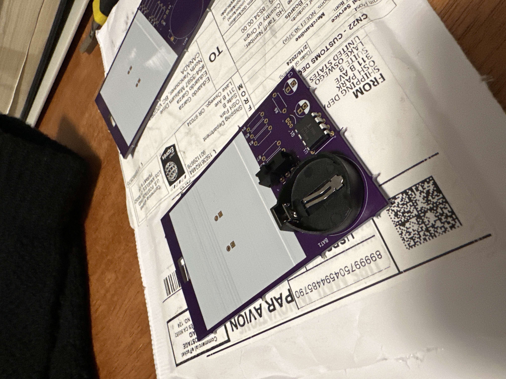
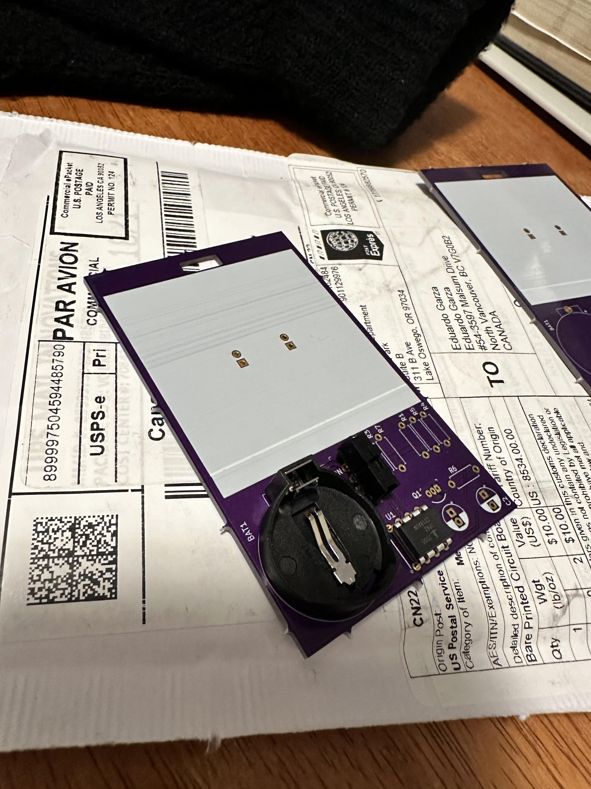
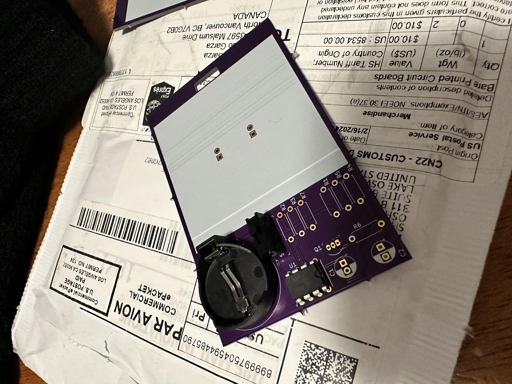
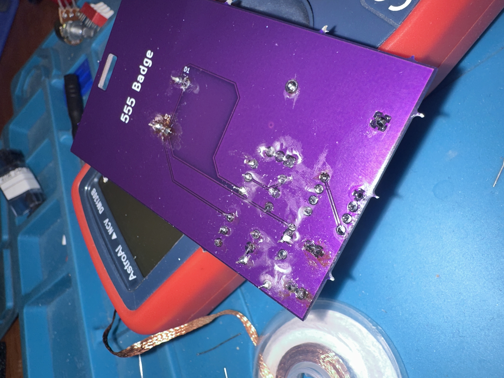
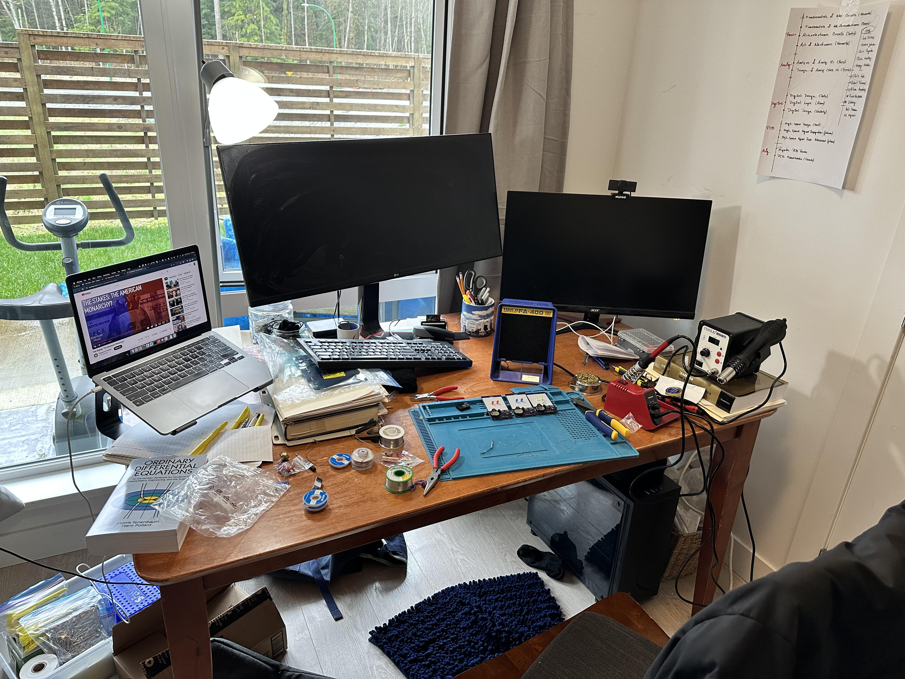
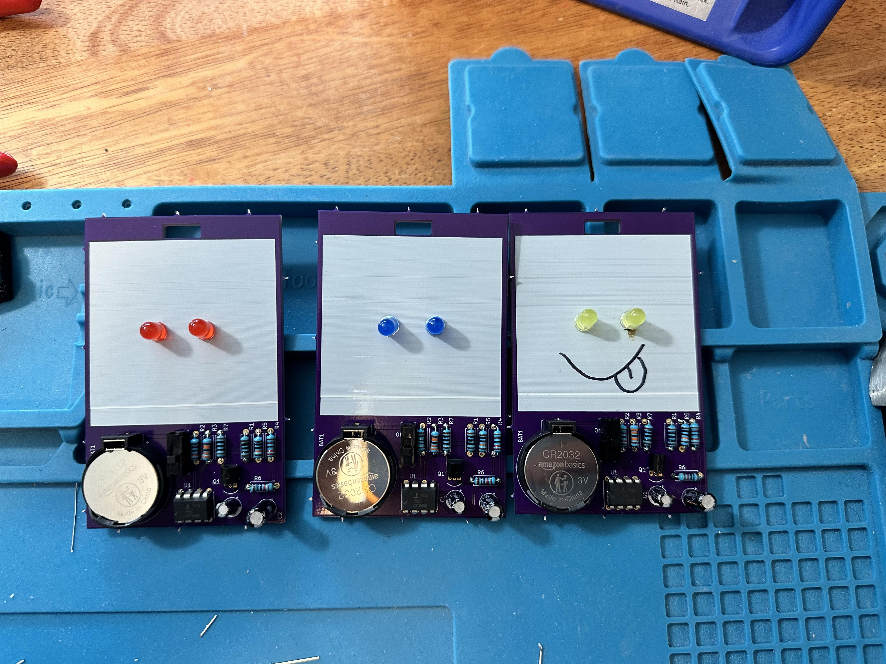
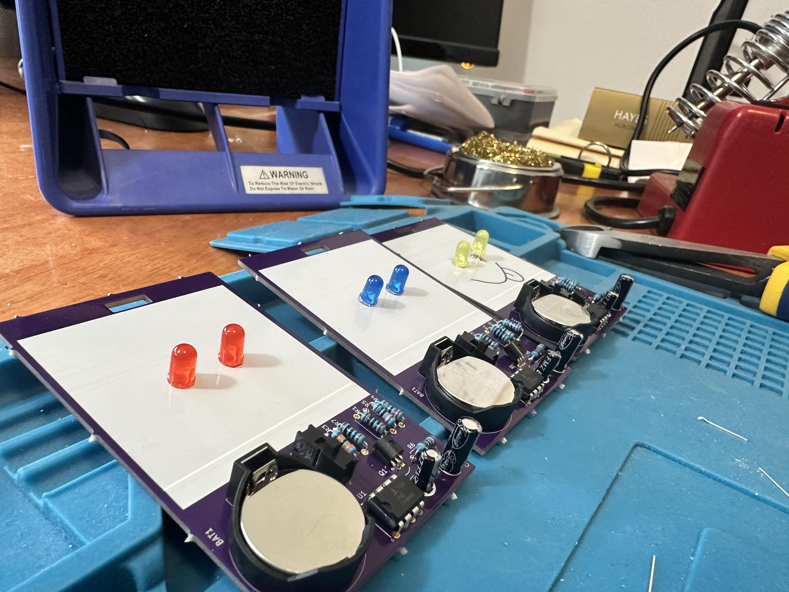
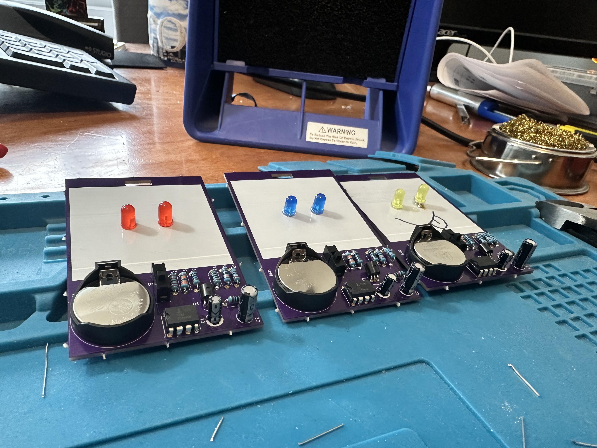
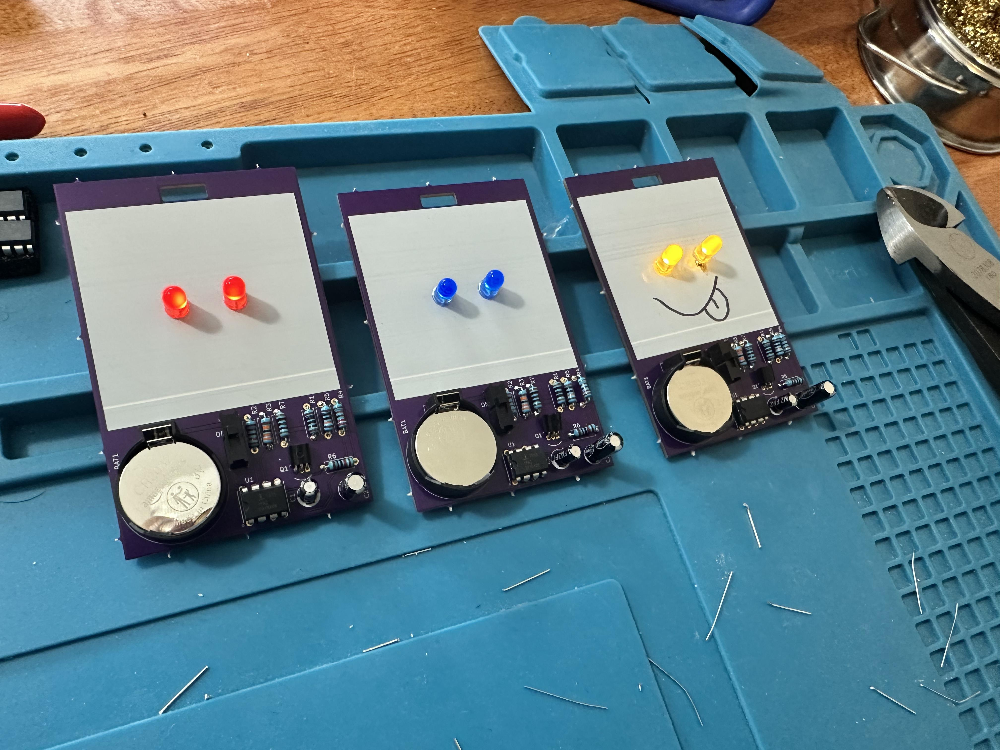
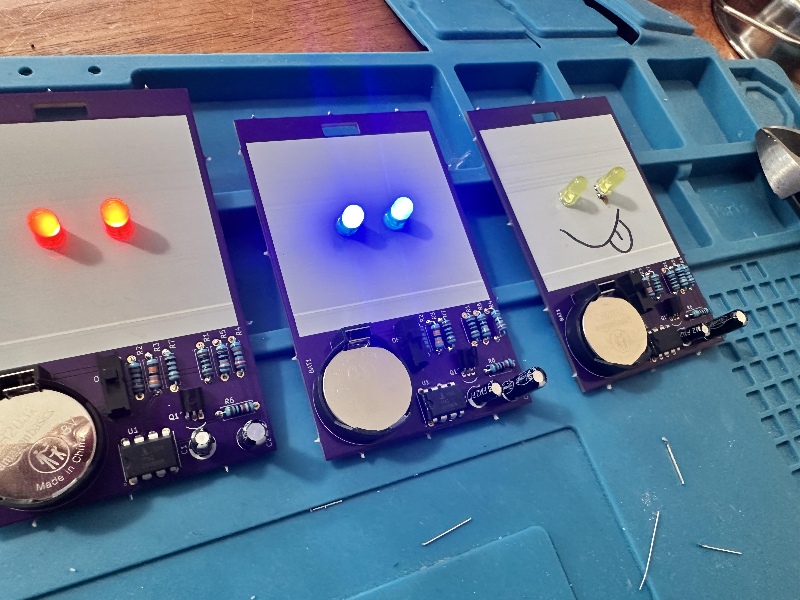
